# **OHDSI ATLAS**  

[Observational Health Data Sciences and Informatics](https://www.ohdsi.org/) (or OHDSI, pronounced "Odyssey"), is a community developing open-source large-scale analytics solutions to bring out the value of health data. One such solution is ATLAS.  

ATLAS is an open-source software application intended to provide a unified interface to patient-level data and analytics. ATLAS software is used to define cohorts, including dichotomous and continuous variables, for analysis.

In general, ATLAS is an analytics platform that can be used to perform analyses across one or more observational databases which have been standardized to the OMOP Common Data Model V5 and can facilitate the exchange of analysis designs with any other organizations across the OHDSI community.

ATLAS currently includes functionality for searching and navigating the vocabulary within the [OMOP Common Data Model (CDM)](https://ohdsi.github.io/TheBookOfOhdsi/CommonDataModel). Users are encouraged to use the [MVP Data Dictionary](./data-dictionary.md) to help with comprehension and curation of custom concept sets. In addition to the search and navigation capabilities, ATLAS also provides features to curate and export custom sets of concept identifiers for use in cohort definitions. Cohort definitions created by users will automatically populate on the Gen3 GWAS App.

Tutorials for the ATLAS tool can be found **[here](https://github.com/OHDSI/Atlas/wiki)** and also in the **[internal MVP documentation](https://vincicentral.vinci.med.va.gov/SitePages/VINCI_University-VADC_Academy.aspx)** (*only accessible from the VA VPN*). The **[Book of OHDSI can be found here](https://ohdsi.github.io/TheBookOfOhdsi/)**. These resources contain a lot of useful information. For using the ATLAS app on this platform, you may find it particularly useful to read about **[Cohort Definition](https://ohdsi.github.io/TheBookOfOhdsi/Cohorts.html#Cohorts)**. It is highly advisable that you familiarize yourself with these resources before proceeding.

## Launching the ATLAS app

From the Apps page, you can double-click the OHDSI Atlas tile to open the ATLAS app. When you first launch the app, it will display a message that the feature is protected, and ask you to log in. Although you are already logged in to the data commons, you must log in specifically to the ATLAS app to gain access to the feature. Click the "Sign In" link (red arrow in screenshot below) to log in to ATLAS.

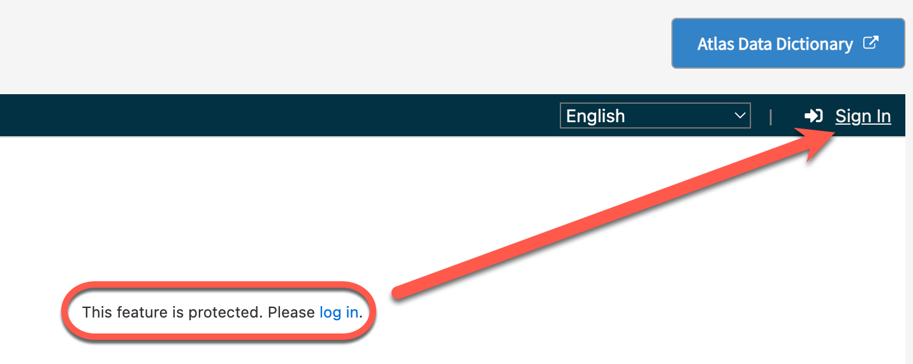{: style="height:250px"}

Clicking Sign In will open a popup that will ask you to sign in with Fence. Click the Fence button to finish the sign-in.  

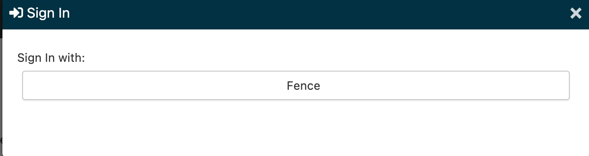{: style="height:150px"}

Once you have signed in to ATLAS, you will see the ATLAS home page. At the bottom of the home page is a button that will allow you to make the ATLAS tool full screen, which may make some searching and navigation easier.  

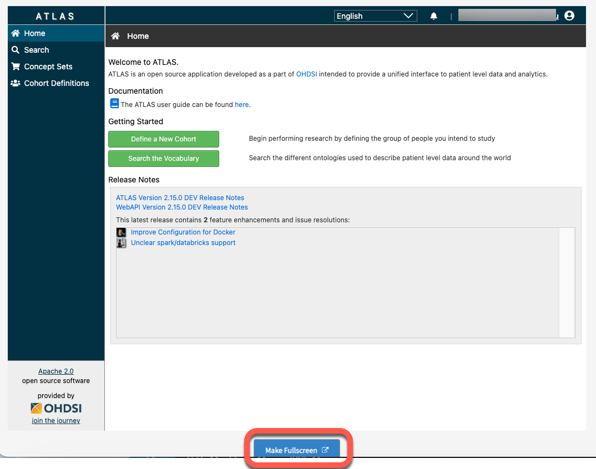

## **Teams in ATLAS**

Team members will have access to all concept sets and cohorts for their team, as well as to global cohorts that are available to everyone. You can only access the items for your selected team or global items. Team members can edit any team members’ cohort. To create or access items for a different team of which you are a member, navigate back to the Apps page and select a different Team project by clicking the edit pencil icon next to your team name.

Some examples of global cohorts include:

* Sex: Male
* Sex: Female
* smoking YES
* smoking NO
* All Genotyped MVP participants

Other global cohorts may be added in the future. Global cohorts are available to all teams, but they are locked; they cannot be directly edited (they can only be changed by the admin team). However, you can make a copy of a global cohort by clicking the Copy icon (red box below) and edit the copy, which will then be available to your team. If you do not want to edit it, a global cohort can be used directly (you do not need to make a copy, in this case).  

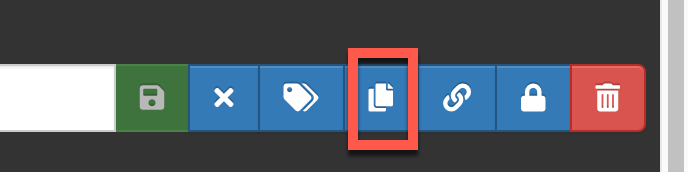  

## **Generate a Cohort**

A cohort is a set of persons who satisfy one or more inclusion criteria for a duration of time. Once created, the cohort can then be the basis for inputs for your subsequent analyses (e.g., GWAS).  

There are 3 tools to help you generate a cohort:

1. **ATLAS Search function:** The Search tool lets you explore the OMOP standardized vocabularies to understand what concepts exist within those vocabularies, and how to apply those concepts in your standardized analysis against your data sources. You can create a concept set from the search results.  
2. **Concept Sets:** A concept set is an expression representing a list of concepts that can be used as a reusable component in various analyses. The Concept Set tool provides you the opportunity to create your own lists of concept codes that you will use in your standardized analyses. You can first search the vocabulary and identify the sets of terms you’re interested in, then save that set and reuse them in all your analyses.  
3. **Cohort Definitions:** The Cohort Definitions tool enables you to create a cohort using one or more of the concept sets you created.  

You can see how to get to these tools using the left navigation menu.  

**Before you define a cohort, you must have a concept set that establishes the inclusion criteria for the cohort.**  

While you are creating a new concept set and defining a new cohort, you may wish to refer to the Data Dictionary periodically. For convenience, we have added a button above the ATLAS window that will launch the Data Dictionary app in a new tab to facilitate switching between ATLAS and the Data Dictionary.  

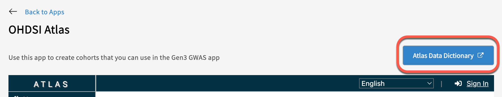

### **Step 1: Create a Concept Set**

Concept Sets are a list of codes created by searching the standardized vocabulary and selecting the set of terms for your analyses. Here, you select all concepts (variables) that you would like to use for criteria that define your study population cohort.

You can create a new concept set by selecting Concept Sets in the left menu (#1) and click the blue box for “New Concept Set” (#2).

Enter a name (#3) and a description (#4) for the Concept Set you are creating. Click the green box “Add concepts” (#5) to view the list of concept variables.

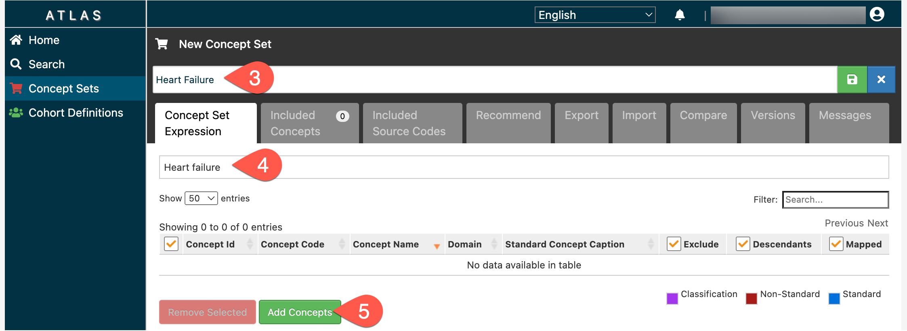

This will open the search tool. Enter the concept name or code into the search bar (#6) to find relevant concept variables, then click the search button (#7). In addition to the basic search, you can refine your search with the Advanced Option link (red box).  

Check the boxes to select the desired concepts (#8), then click “Add To Concept Set” (#9). Repeat Search and Add steps as needed, then click “Concept Sets” in the left navigation pane (#10) to return to your concept set.  

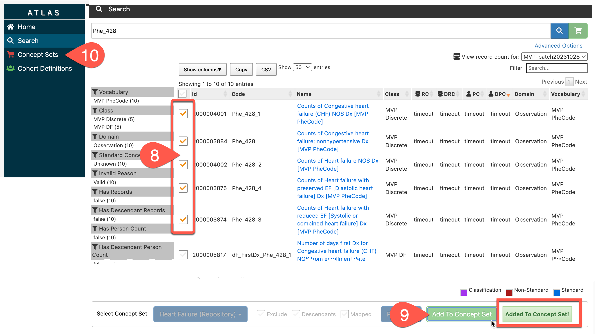

> Note: if you click Add to Concept Set more than once for the same checked concepts, you will add the concepts to your set multiple times. You can delete the multiples using the Remove Concepts button (red box below), but it's easier to try to avoid adding more than once.  

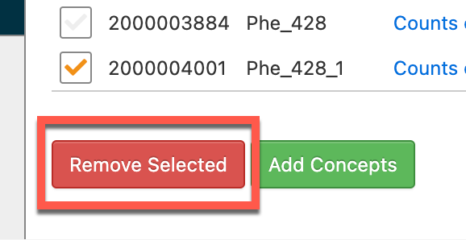{: style="height:125px"}

When all desired concepts are included in your Concept Set, click the Save icon to the right of the name of the Concept Set.

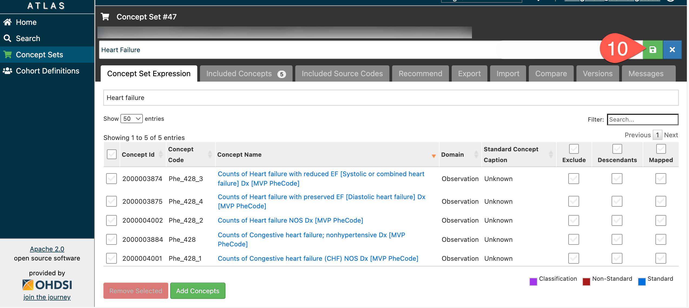

To add new concepts, please use the “Add Concepts” button again as described above.

#### To return to the list of concept sets

While developing a concept set - whenever you click on the Concept Set menu button, it will automatically load your concept set under development. After you have saved your concept set, you will have more buttons up by the save button. One of these is an X button (red arrow); when clicked, this will close your concept set and return you to the full list of concept sets.  

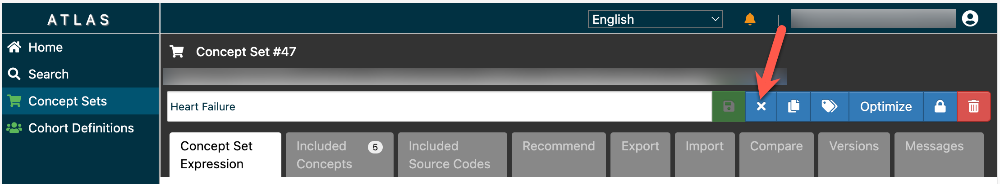

### **Step 2: Create Cohort Definition**

A cohort is a set of persons who satisfy one or more inclusion criteria for a duration of time.

Use the concept sets to create initial events and other criteria for defining the study population cohort. A cohort is defined as a Person with an entry and exit date.

To define a new cohort, click on “Cohort Definitions” (#11), then click the “New Cohort” button (#12).

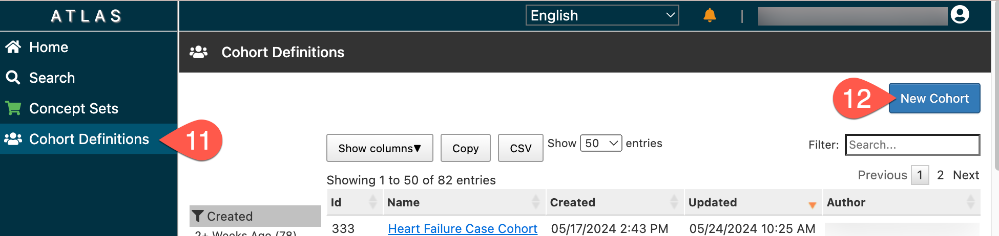

This will open a New Cohort window that looks like this:

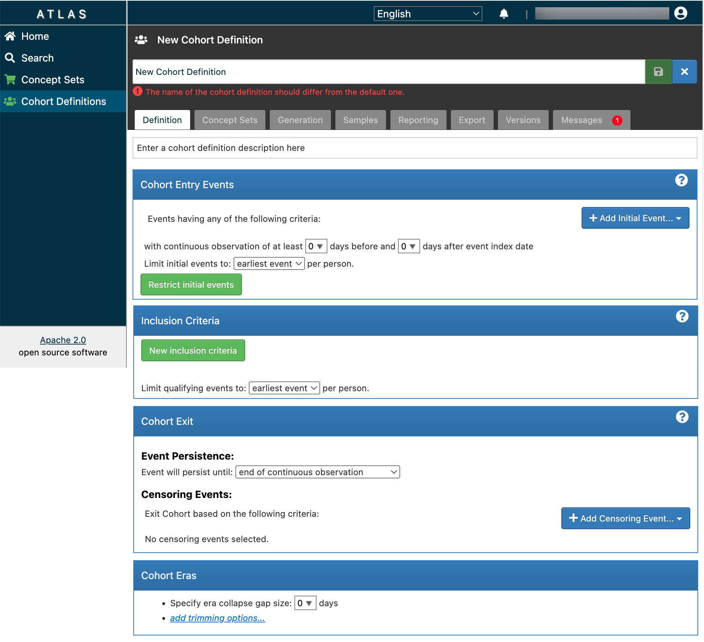

Start by entering a name (#13) and description (#14) for the cohort. Then, establish the initial Entry Event criteria for your cohort by clicking Add Initial Event (#15), then select Add Observation (#16).

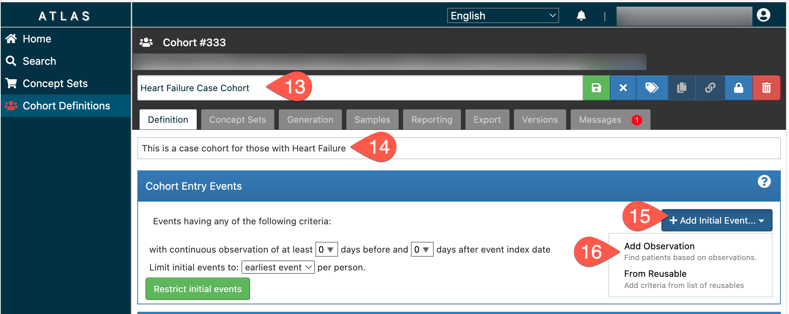

Click Any Observation (#17), then select Import Concept Set (#18) from the dropdown menu.

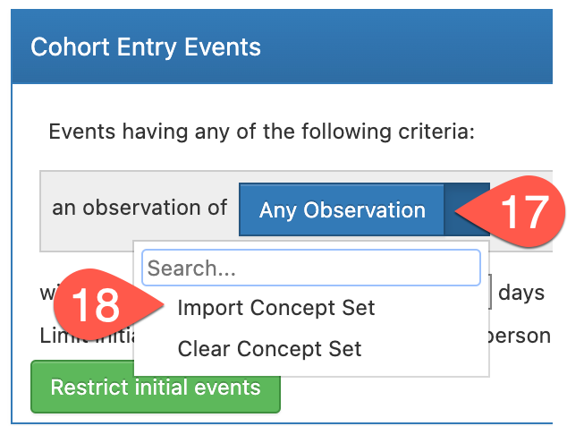{: style="height:250px"}

Select the Concept Set you just made (#19). This establishes your Concept Set as basic inclusion criteria for your cohort.

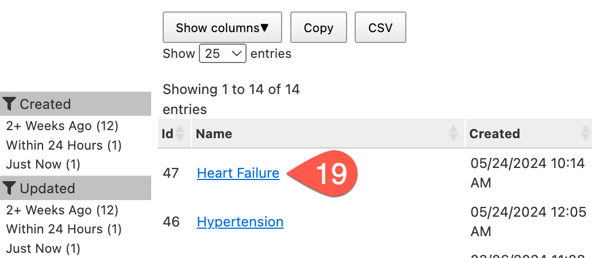{: style="height:200px"}

To access the table in the MVP harmonization database, click “+ Add attribute…” (#20), then click “Add Value as Number Criteria” (#21).

Select “Greater or Equal To”. In this specific case, we added the Heart Failure concept set and entered the value "2". Here, we are saying to include anyone who has any entry-criteria-events two or more times (e.g., experiences 2 or more heart failure events.) This will allow for the collection of data from the Observation table of the MVP database.

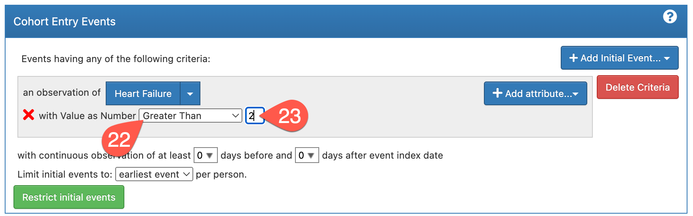

If you only define entry event criteria, you will have the broadest cohort. If you want to further refine the cohort definition, you can add additional inclusion or exit criteria in the boxes below Cohort Entry Events. You can create separate concept sets to define these criteria. To complete the Cohort Definition, click the green Save icon in the top right corner.

#### To return to the list of cohorts

While developing a cohort - whenever you click on the Cohort Definitions menu button, it will automatically load your cohort under development. After you have saved your cohort, you will have more buttons up by the save button. One of these is an X button (red arrow); when clicked, this will close your cohort and return you to the full list of cohort definitions.  

### **Step 3: Generate Cohort**

Once generated, the cohort can then serve as the basis of inputs for your subsequent analyses (e.g., in the GWAS app). To complete the creation of the Cohort Definition, click the Generation tab (#24), then click Generate (#25). The status will be Pending while it is generating (red box), and will change to Complete once the cohort is generated.  

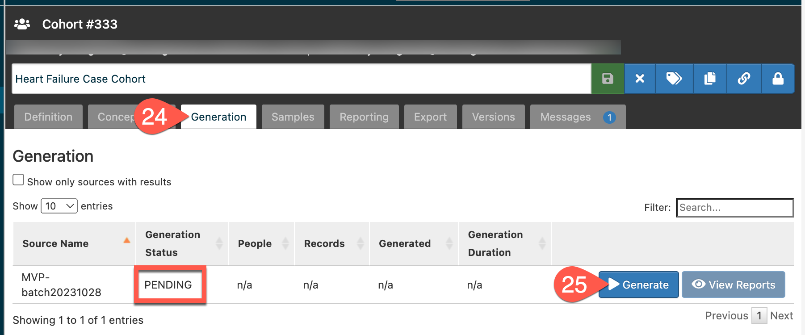

Cohort size will be displayed under the column “People” (red arrow). Use View Reports (red box) to see if you have inclusion criteria that causes cohort attrition. If you did not define any additional inclusion criteria, the reports will show 0.  

If you later change the criteria in the definition or the concept set, you can run Generate again to update your cohort definition for the new criteria.  

The “Export” tab provides a text version of how a cohort was created. Click on the “Export” tab and then on the “Copy to clipboard” to copy the cohort’s information.

Once created and saved, the cohort definition will be available to the user as well as to other members of the team in the Gen3 GWAS app.

Use the cohort definition to identify how many people are in the cohort. This is the initial number that will be used in the GWAS App when this cohort is selected.

We expect that this documentation along with the OHDSI tutorials are sufficient for most analyses that users will attempt. If you have any questions, please contact us at [vadc@lists.uchicago.edu](mailto:vadc@lists.uchicago.edu).  
