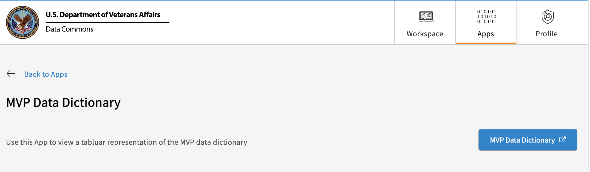

# **MVP Data Dictionary**  

The [Data Dictionary App](https://va.data-commons.org/analysis/MVP%20Data%20Dictionary) connects users to the static MVP data documentation which contains definitions, descriptions, and metadata for the variables and concepts available in the VADC ATLAS OHDSI and GWAS apps. This is also available through a link from the [VADC ATLAS OHSDI page](https://va.data-commons.org/analysis/OHDSI%20Atlas).  

When selecting Data Dictionary from the Apps browser, the user will be presented with a button. This button directs the user to an outside tab. Clicking on the MVP Data Dictionary button will automatically launch a popup explaining that the link takes the user away from VADC. Clicking the “OK” button will open the dictionary in a new tab of the user’s browser, allowing toggling between the two sites. **Please note- the site is only accessible from within the VA's VPN.**   

