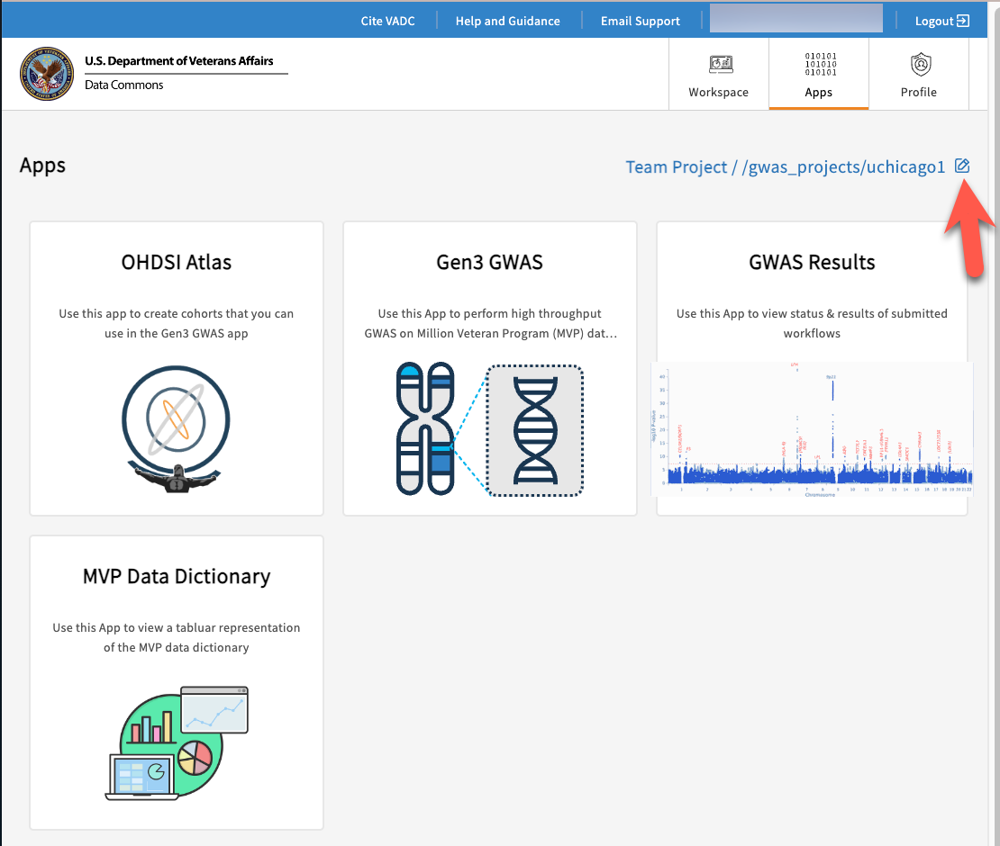

# **Data Access and Analysis**

## **Apps page**

The [Apps page](https://va.data-commons.org/analysis) displays the option of four apps: OHDSI Atlas, Gen3 GWAS, GWAS Results and Data Dictionary. Using these Apps, a user may perform a genomic analysis on available data from projects that they have access to.  

### **Teams**

Navigating into Apps for the first time will result in a pop-up window requiring the user to select a "Team project". Once selected, the user will see the Team project name in the upper right of all Apps pages and will have access to all team cohorts, GWAS runs and results. Note that only the shared objects of the selected team are accessible. If there is a need to create or access items for a different team, you will need to navigate back to the Apps page and select a different Team project.

### Apps Links

The links below will jump to the documentation pages for each of the Apps:

* [Data Dictionary App](data-dictionary.md)
* [OHDSI ATLAS App](OHDSI-atlas.md)
* [GWAS App](gwas.md)
* [GWAS Results App](gwas-results.md)

## **Workspaces**

Currently, workspaces are not available, and therefore you may see an error when attempting to log into this page. Generally, workspaces are secure data analysis environments in the cloud that can access data from one or more data resources. Workspaces include Jupyter notebooks and JupyterLab, Python and RStudio. For more information about the Gen3 Workspaces, you may refer to [Gen3 Workspaces](https://gen3.org/products/workspaces/) and [Data Analysis in a Gen3 Data Commons](https://gen3.org/resources/user/analyze-data/).
