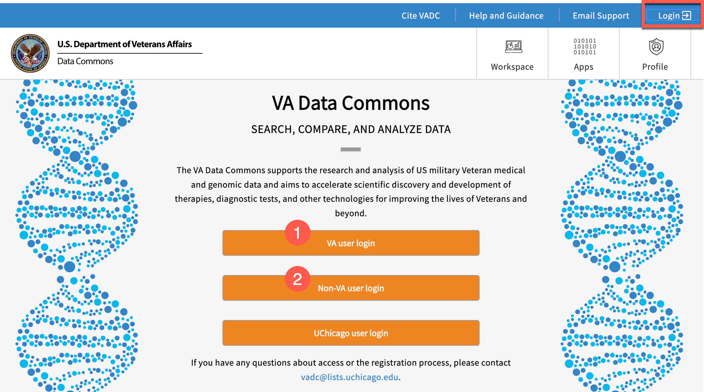
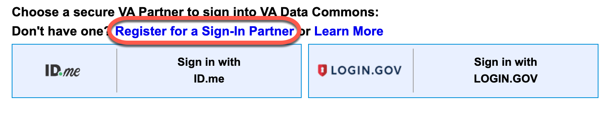

# **Getting Started**

## **Login Page**

Start by visiting the [login page](https://va.data-commons.org/login) (red box in screenshot below).

There are several options for logging in to the VA Data Commons:  

* **VA user login** (#1 in screenshot above) - This login is available to all VA-affiliated users. Users will log in with their VA PIV credentials. Click this link for more information about using the [PIV login](https://digital.va.gov/employee-resource-center/remote-access/cag-using-windows/?redirect=1#piv).  
* **Non-VA user login** (#2 in screenshot above) - This login has been enabled by AccessVA, and permits non-VA users to login to the VADC through signing on with either a Login.GOV or an ID.me account. If you do not yet have one of these accounts, you can click this login for the option to create one (see the red box below).
        
        *Note: VA users can also log in with the Non-VA user button, BUT they should be sure to use the same email address for ID.me or Login.gov that they use VA authentication or else they will not have the same permissions.*
* *There is also a third log-in option for the platform development team at UChicago; this login is not open to other users.*

After successfully logging in, your username will appear in the upper right-hand corner of the page.  

Once logged in, the user will see there are several options in the upper right hand corner of the [home screen](https://va.data-commons.org/). In the blue bar at the top of the page, there is a link to VA Data Commons Documentation (*the page you are currently reading*), Email Support, your username, and a log out button. Below these options, there are tabs for the Workspace, Apps, and Profile pages.  

Clicking on the VA Data Commons logo in the upper left hand corner of the screen will always return you to the home page of the data commons.  

### **VA Data Commons Documentation**

The button for VA Data Commons Documentation takes you to the home page for the documentation you are reading.  

### **Email Support**

If you need help, the Email Support button allows you to send a message to our help desk at [vadc@lists.uchicago.edu](mailto:vadc@lists.uchicago.edu). You may expect a response within 2 business days.  